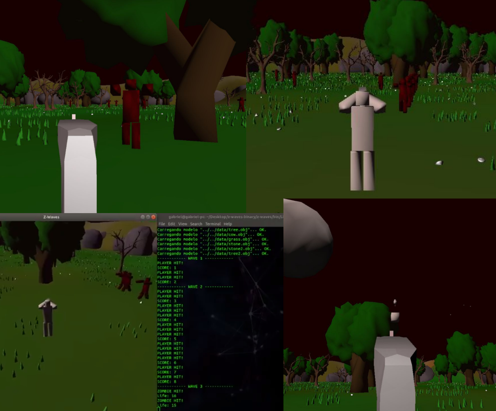

# :zombie: z-waves

Z-Waves is a game where you survive in a zombie-apocalyptic world. There are successive waves of zombies, making the game harder and harder.
You can find "Cow boosts", which give more speed, rate of fire, and extra life.

This project was built using OpenGL for the Fundamentals of Computer Graphics course at [INF](https://inf.ufrgs.br)-[UFRGS](https://ufrgs.br).

